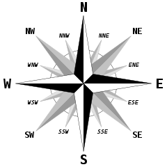

# Analog Clock Master

## Video Demo:  [Analog Clock Master](https://www.youtube.com/watch?v=y2SL9oEw5NQ)

### Description

___

#### Purpose of the project

The purpose of this program is to help read analog clock.

Nowadays most of the devices we use for time checking are digital.

Look around yourself and find time device. Is it analog? If so, you are quite lucky. Most common device we use for time checking are:

- mobile phone,
- digital watch,
- computer screen.

They usually work in digital mode. This raises a problem with understanding analog clock face.

Why ability of reading analog clock is so important?

1. Cardinal directions

    To read a map man must understand directions. Not only cardinal and ordinal directions but secondary intercardinal directions as well.

    

    *Wikimedia Commons. Brosen windrose.svg. CC BY 2.5*

2. Angels

    Angels are very important part of Euclidean geometry.

    

    *Wikimedia Commons. Right angel.svg. CC BY 2.5*

Of course there are many fields in which reading analog clock can be helpful, but these two are the most important.

___

#### Program structure

1. GUI

    The main problem with the project was to choose the right library for graphical users interface. I started with tkInter, slowly migrating towards Custom tkInter.

    Main window layout is set with grid method. Window is non-resizable, and adjusts its size to the screen size.

    Clock face is static, and is drawn in CTkCanvas widget.

    Clock hands are draw dynamically, accordingly to set time.

2. Functional approach

    Although object-oriented approach can be implied in this program, lack of multiple objects of the some class has driven me to functional approach.

3. Program overview

    Program is running in ***main function***.

    ***draw_clock_face function*** is responsible for drawing clock face.

    Three consecutive functions:

        - draw_hour_hand,
        - draw_minute_hand,
        - draw_second_hand

    are responsible for animation of the clock. They receive updated time from ***new_hour, new_minute and new_second functions***.

    Calculation of the new time is triggered either by clicking ***start button*** or by submitting correct answer.

    The heart of this program is ***check_func function***. It is responsible for checking correctness of the users input and returning corresponding message to the user.
    Checking algorithm is based on regular expression.

    Rest of the functions is used mainly for layout and styling. Including disabled ***layout_help function***, which is used only during developing stage.

### Final word

This is my first project of this scale. I am fully aware of missing functionality, that would improve user's experience. Project will evolve...
